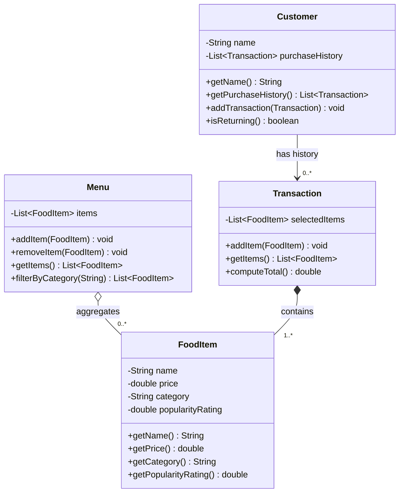

# ByteBites — Revised UML Class Design

This document presents the revised UML class diagram for the ByteBites backend,
derived from `bytebites_spec.md`. It covers the four canonical classes —
`Customer`, `FoodItem`, `Menu`, and `Transaction` — kept deliberately small to
match the spec's intent (no auth, payment, or persistence layers).

## Class Diagram

## Responsibilities

| Class | Responsibility |
| --- | --- |
| `Customer` | Holds a customer's name and their past purchase history; can confirm a user is "real" by exposing whether they have prior transactions. |
| `FoodItem` | Represents a single sellable item with its name, price, category, and popularity rating. |
| `Menu` | Holds the full catalog of `FoodItem`s and supports filtering by category (e.g. "Drinks", "Desserts"). |
| `Transaction` | Groups the items a user selected into one purchase and computes the total cost. |

## Relationship Notes

- **`Menu` o-- `FoodItem` (aggregation, 0..\*)** — The menu groups food items, but
  items have an independent lifecycle: removing an item from the menu does not
  destroy the item itself, and the same item definition can be referenced
  elsewhere (e.g. in a transaction).
- **`Transaction` \*-- `FoodItem` (composition, 1..\*)** — The selected items belong
  to that transaction's purchase. A transaction is meaningful only with at least
  one item, so the multiplicity is 1..\*.
- **`Customer` --> `Transaction` (directed association, 0..\*)** — A customer knows
  its transactions (purchase history) but a transaction does not need to point
  back to the customer. The spec only requires customers to track their own
  history, so the reference is one-directional. A new customer with no history
  is valid, hence 0..\*.

## Design Choices (where the spec is silent)

- **`Customer.isReturning()`** is added as the simplest way to satisfy the spec's
  goal of "verifying they are real users" via purchase history, rather than
  inventing an auth/credentials system.
- **No `id`/key fields** were added on any class — the spec never mentions
  identifiers, so we avoid speculative persistence concerns.
- **`Transaction` stores `FoodItem`s directly** (not quantities) since the spec
  says it "stores the selected items"; duplicates can be represented by repeated
  list entries if the same item is picked twice.
- **`popularityRating` is a `double`** (e.g. a 0–5 star average); the spec does not
  define its scale, so the type is left as a simple numeric value.
