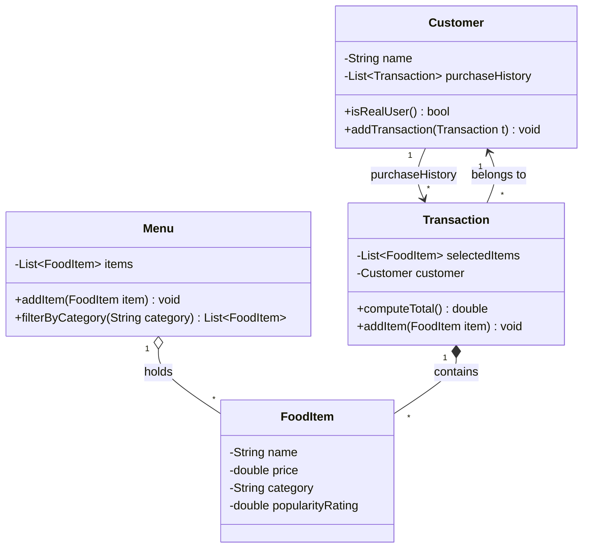

# ByteBites — UML Class Diagram

## Class Responsibilities

| Class | Attributes (from spec) | Key behavior |
|-------|------------------------|--------------|
| **Customer** | `name`, `purchaseHistory` | Verify they're a real user (via purchase history) |
| **FoodItem** | `name`, `price`, `category`, `popularityRating` | Pure data holder |
| **Menu** | `items` (full collection) | Filter by category ("Drinks", "Desserts") |
| **Transaction** | `selectedItems`, `customer` | Compute total cost |

## Relationship Notes

- `Menu o-- FoodItem` (**aggregation**) — the menu holds items, but items can exist independently of any one menu.
- `Transaction *-- FoodItem` (**composition**) — a transaction groups the picked items; could be aggregation if items are shared references.
- `Customer --> Transaction` — the purchase history is a one-to-many link used for verification.
